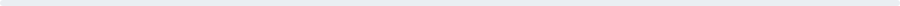

# Simone Marangoni

<a href="https://marangonisimone.netlify.app"><picture><source media="(prefers-color-scheme: dark)" srcset="https://img.shields.io/badge/PORTFOLIO-0d1117?style=flat-square&logoColor=ffffff"/></picture></a>
<a href="https://www.linkedin.com/in/simonemarangoni/"><picture><source media="(prefers-color-scheme: dark)" srcset="https://img.shields.io/badge/LINKEDIN-0d1117?style=flat-square&logo=linkedin&logoColor=ffffff"/></picture></a>
<a href="https://github.com/Simone-Marangoni"><picture><source media="(prefers-color-scheme: dark)" srcset="https://img.shields.io/badge/GITHUB-0d1117?style=flat-square&logo=github&logoColor=ffffff"/></picture></a>

<picture><source media="(prefers-color-scheme: dark)" srcset="assets/dark/divider.svg"/></picture>

### About

Computer Engineering student at the **University of Padua**, holding a Technical Diploma in Computer Science and Telecommunications from ITT G. Chilesotti (**100/100**). Passionate about full-stack development, IT infrastructure, and building systems that just work — from the code to the network they run on.

<picture><source media="(prefers-color-scheme: dark)" srcset="assets/dark/divider.svg"/></picture>

### Tech Stack

- **Languages:** C, C++, C#, Java, JavaScript, PHP, Python
- **Markup:** HTML, XML, JSON
- **Databases:** SQL, phpMyAdmin, basic Oracle
- **Systems:** Windows, macOS, Linux
- **Networking:** Data network configuration, installation, and management
- **Electronics:** Arduino, robotics

<picture><source media="(prefers-color-scheme: dark)" srcset="assets/dark/divider.svg"/></picture>

### Experience

- **OpenFiber** — School-to-work training program, fiber-optic network deployment
- **Brazzale SpA** — School-to-work training program, systems monitoring and business infrastructure

<picture><source media="(prefers-color-scheme: dark)" srcset="assets/dark/divider.svg"/></picture>

### Education

- **2024 — now** · University of Padua — B.Sc. Computer Engineering
- **2024** · ITT G. Chilesotti — Diploma, Computer Science & Telecommunications (100/100)

<picture><source media="(prefers-color-scheme: dark)" srcset="assets/dark/divider.svg"/></picture>

### Currently

- 🎓 Studying Computer Engineering at the University of Padua
- 🔐 Exploring cybersecurity fundamentals
- 🌱 Looking for opportunities to apply what I've learned to real, concrete projects

<picture><source media="(prefers-color-scheme: dark)" srcset="assets/dark/divider.svg"/></picture>

<picture><source media="(prefers-color-scheme: dark)" srcset="https://github-readme-stats.vercel.app/api/top-langs/?username=Simone-Marangoni&layout=compact&theme=github_dark&hide_border=true&bg_color=0d1117"/></picture>

<picture><source media="(prefers-color-scheme: dark)" srcset="assets/dark/divider.svg"/></picture>

🇮🇹 Italian (native) · 🇬🇧 English (B2)

