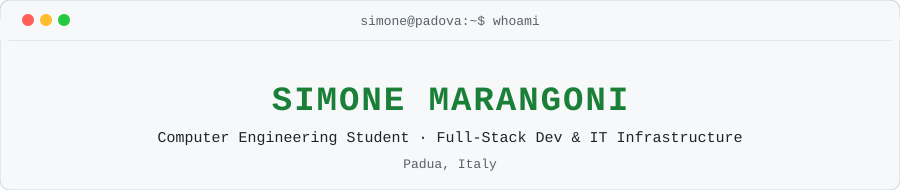
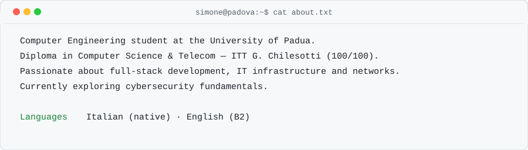

<picture><source media="(prefers-color-scheme: dark)" srcset="assets/dark/header.svg"/></picture>

<a href="https://marangonisimone.netlify.app"><picture><source media="(prefers-color-scheme: dark)" srcset="https://img.shields.io/badge/PORTFOLIO-0d1117?style=flat-square&logoColor=f0f6fc"/></picture></a>
<a href="https://www.linkedin.com/in/simonemarangoni/"><picture><source media="(prefers-color-scheme: dark)" srcset="https://img.shields.io/badge/LINKEDIN-0d1117?style=flat-square&logoColor=f0f6fc"/></picture></a>
<a href="https://github.com/Simone-Marangoni"><picture><source media="(prefers-color-scheme: dark)" srcset="https://img.shields.io/badge/GITHUB-0d1117?style=flat-square&logoColor=f0f6fc"/></picture></a>

<picture><source media="(prefers-color-scheme: dark)" srcset="assets/dark/about.svg"/></picture>

<picture><source media="(prefers-color-scheme: dark)" srcset="assets/dark/stack.svg?v=2"/></picture>

<picture><source media="(prefers-color-scheme: dark)" srcset="assets/dark/experience.svg"/></picture>

<picture><source media="(prefers-color-scheme: dark)" srcset="assets/dark/education.svg"/></picture>

<picture><source media="(prefers-color-scheme: dark)" srcset="assets/dark/status.svg"/></picture>

<picture><source media="(prefers-color-scheme: dark)" srcset="assets/dark/languages.svg"/></picture>

<!-- one responsive picture per section; asset SVGs live under /assets and /assets/dark -->
