<picture><source media="(prefers-color-scheme: dark)" srcset="assets/dark/profile-card.svg"/></picture>

<a href="https://marangonisimone.netlify.app"><picture><source media="(prefers-color-scheme: dark)" srcset="https://img.shields.io/badge/PORTFOLIO-0d1117?style=flat-square&logoColor=ffffff"/></picture></a>
<a href="https://www.linkedin.com/in/simonemarangoni/"><picture><source media="(prefers-color-scheme: dark)" srcset="https://img.shields.io/badge/LINKEDIN-0d1117?style=flat-square&logo=linkedin&logoColor=ffffff"/></picture></a>
<a href="https://github.com/Simone-Marangoni"><picture><source media="(prefers-color-scheme: dark)" srcset="https://img.shields.io/badge/GITHUB-0d1117?style=flat-square&logo=github&logoColor=ffffff"/></picture></a>

<picture><source media="(prefers-color-scheme: dark)" srcset="https://github-readme-stats.vercel.app/api/top-langs/?username=Simone-Marangoni&layout=compact&theme=github_dark&hide_border=true&bg_color=0d1117"/></picture>

